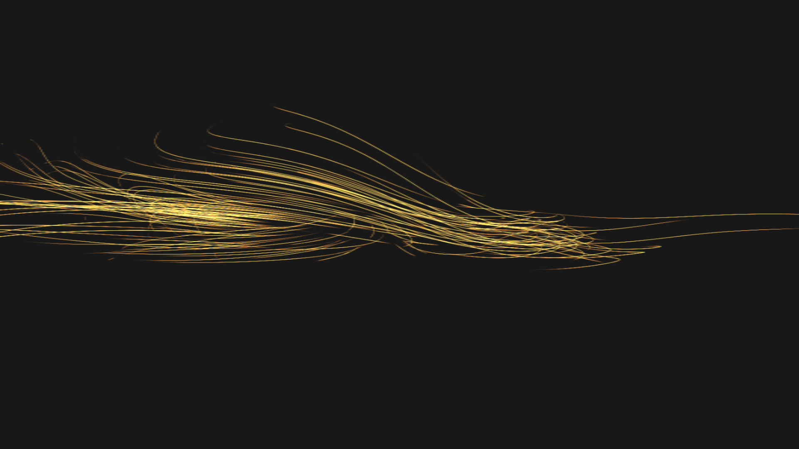

# Unity-Demos

### These are quick daily demos, keeping things lean, fuctional yet beautiful.

## Projects

Here's an overview, of these projects and their links.

---

### Ice Shader

AIM: To create a simple ice shader, using Shader Graph.
[Link to project](https://github.com/RichieWallett/Unity-Demos/tree/main/Ice_Shader_01)

---

### Curling Particles 

AIM: To generate amorphous particle behaviours and score sound sympathetic to it.

[Link to project](https://github.com/RichieWallett/Unity-Demos/tree/main/Particles_Curl_02)
