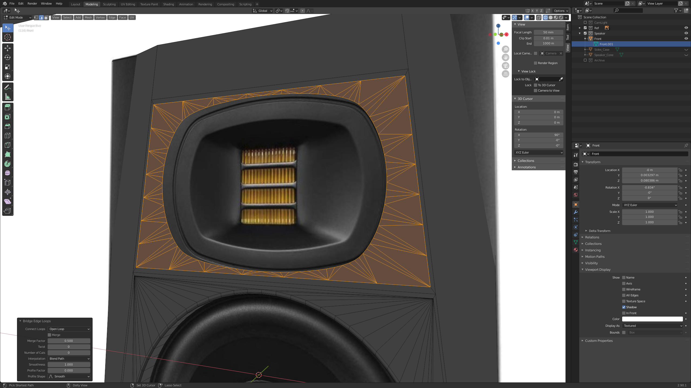
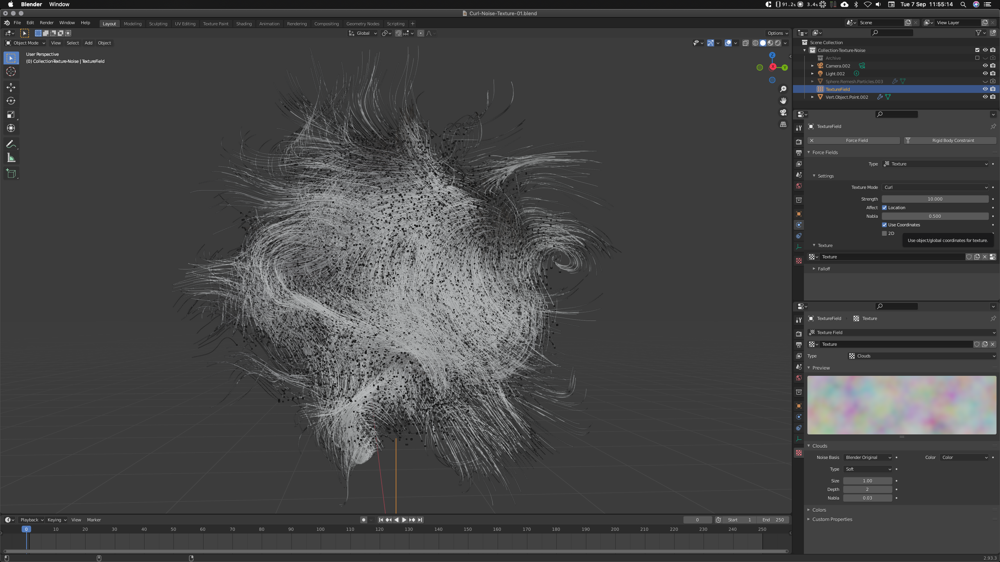

# Real-time Daily Demos

### These are quick, daily demos. 
The aim is to keep things lean, functional & beautiful. Here's an overview of each day project and the processes undertaken.

---

### Modeling Sound 

AIM: To create a mesh, all materials and textures, from reference images only.  [Link to project](https://github.com/RichieWallett/Unity-Demos/tree/main/Adam-Audio)

---

### Audi Capture

AIM: Examples of other projects. [Link to projects](https://github.com/RichieWallett/Unity-Demos/tree/main/Various)

---

### Noise Curls 

AIM: To generate free flowing particle behaviours. [Link to project](https://github.com/RichieWallett/Unity-Demos/tree/main/Particles_Curl_01)

---

### Curling Particles 

AIM: To generate amorphous particle behaviours and score sound sympathetic to this. [Link to project](https://github.com/RichieWallett/Unity-Demos/tree/main/Particles_Curl_02)

---

### Ice Shader

AIM: To create a simple ice shader, using Shader Graph.
[Link to project](https://github.com/RichieWallett/Unity-Demos/tree/main/Ice_Shader_01)

---

### Modeling

AIM: Demonstrate simple fundamentals of 3D (Blender) [Link to projects](https://github.com/RichieWallett/Unity-Demos/tree/main/Doughnut)

---

### Materials

AIM: Exploring unique materials (Blender) [Link to projects](https://github.com/RichieWallett/Unity-Demos/tree/main/Coffeecup)

---

### Overview

AIM: To describe my conceptual & technical approach. [Link to projects](https://github.com/RichieWallett/Unity-Demos/tree/main/Overview)
